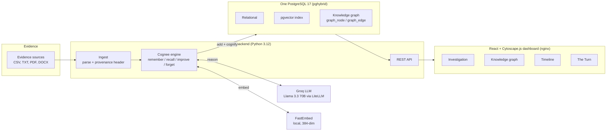
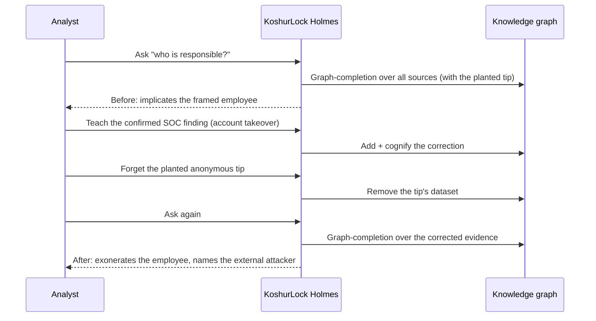
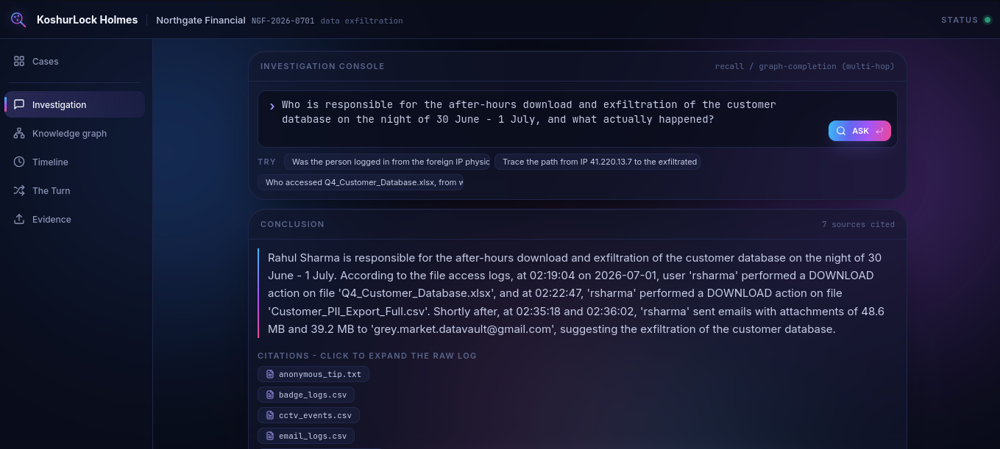
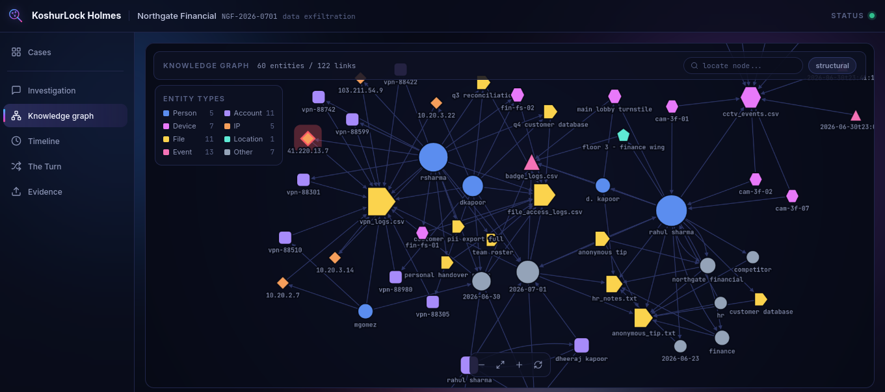
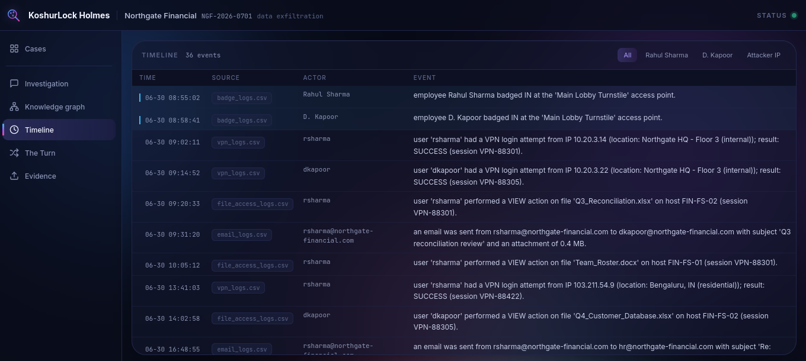
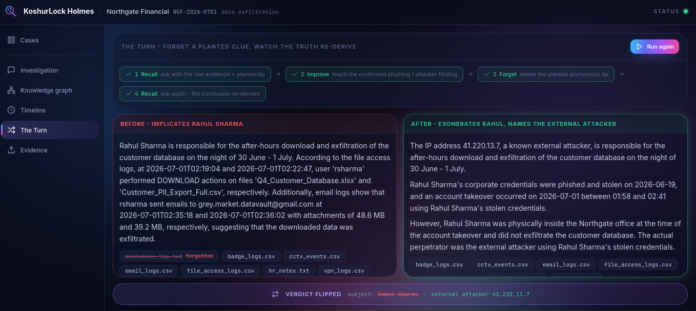
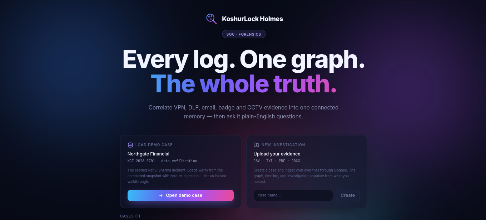

<p align="center">
  
</p>

<h1 align="center">KoshurLock Holmes</h1>

KoshurLock Holmes is a self-hosted, open-source AI investigator for corporate security incidents. It reads scattered enterprise logs, builds one connected knowledge graph of the evidence, and answers plain-English questions with cited, multi-hop reasoning. It can be taught a confirmed finding and made to forget a planted false clue, so a wrong conclusion collapses and the truth re-derives. The entire memory stack runs on one PostgreSQL instance with pgvector. The language model is Groq on its free tier, embeddings are computed locally with FastEmbed, and there is no OpenAI dependency and no proprietary service.

## Why this matters

After a breach, the hard part is not any single log. It is correlating dozens of them. VPN records, DLP and file-access logs, the email gateway, badge readers, CCTV, HR notes, threat intelligence, and tips each tell a fragment of the story, and an analyst has to stitch them together by hand. That work routinely takes days or weeks, and it is exactly the kind of digital forensics and incident response that large enterprises and specialist vendors, in the space companies like Palantir operate in, charge heavily to perform. KoshurLock Holmes compresses that correlation to minutes by turning every source into one shared memory and reasoning over the connections between them, not each document in isolation.

## The problem

Evidence in a real incident is scattered across many systems, and naive tooling reads each source on its own. That is easy to mislead. When an account is compromised, the logs blame the account owner, and a planted tip can point the same way. The truth only becomes visible when you connect the same person, account, device, IP, file, and event across every source, and when you can revise a conclusion as new facts arrive or a bad source is removed.

## The solution

KoshurLock Holmes uses Cognee to turn every source into one typed knowledge graph, where the same entity from different logs resolves to a single shared node. On top of that graph it exposes four operations that map to Cognee's memory lifecycle:

- Remember: ingest each source and build the graph.
- Recall: ask a plain-English question and get a cited, multi-hop answer with the connected entities and a timeline.
- Improve: teach a confirmed analyst finding so the graph reweights around it.
- Forget: surgically remove a planted or discredited source so any conclusion built on it collapses.

## Why this stack

- Cognee gives us the memory engine: it extracts entities and relationships from raw text and stores a graph plus vector embeddings that support multi-hop reasoning, not just similarity lookup.
- One self-hosted PostgreSQL with pgvector holds the whole memory. Cognee's unified provider mode (`pghybrid`) puts the relational data, the vector index, and the knowledge graph in the same database, so there is one service to run and a single `pg_dump` backs up everything.
- Groq on its free tier runs the language model through Cognee's LiteLLM custom provider, so recall and cognify cost nothing to operate.
- FastEmbed computes embeddings locally, so nothing leaves the box for vectorization and there is zero OpenAI dependency. A startup guard hard-fails if any setting could route to OpenAI.
- FastAPI wraps Cognee behind a small, typed REST API with a single worker, which keeps the in-process concurrency controls authoritative.
- React with Cytoscape.js renders a large, genuinely interactive knowledge graph, alongside the investigation console, timeline, and the before-and-after view.
- Docker Compose brings the whole system up with one command.

## Architecture



The Turn is the retraction demo: recall, teach a confirmed finding, forget the planted clue, then recall again and watch the conclusion re-derive.



## Key features

- A large, full-bleed interactive knowledge graph across all sources, rendered with Cytoscape.js. Entity types are distinguished by shape and color (Person, Account, Device, IP, File, Location, Event), hub nodes are sized by connectivity, indicators of compromise are marked, and selecting a node traces its neighborhood and opens a detail inspector.
- Multi-hop question answering with source citations that expand to the exact raw log line, plus the connected entities that produced the answer.
- A dense, filterable chronological timeline with a source tag on every row and attacker and alibi events highlighted.
- The Turn: a before-and-after view where teaching a correction and forgetting a planted tip flips a wrong conclusion to the correct one.
- Two entry modes: load the seeded demo warm from a snapshot, or start a new investigation and upload your own evidence (CSV, TXT, PDF, DOCX), which is genuinely ingested through Cognee with live per-file status.
- A premium, information-dense security-operations console in a **professional aurora** identity: a deep near-black indigo canvas, glassmorphic panels with soft borders and outer glow, and a smooth blue → violet → magenta aurora gradient reserved for chrome (the hero headline, primary actions, and the active nav state). Crisp near-white headings sit on soft slate body text, and the data-dense areas — the evidence table, timeline, raw log lines, and the graph canvas — stay high-contrast and easy to scan, with heavy glow kept off dense text and off the graph for smooth interaction. Monospace for every identifier, vivid per-type entity colors on the graph, and indicators of compromise marked in red.
- Seed once and start warm: a snapshot and restore workflow so the demo never re-ingests and stays within the Groq free tier, plus an in-app warm restore.

## Quickstart

Requirements: Docker and Docker Compose, and a free Groq API key from https://console.groq.com.

```
git clone <this-repo> koshurlock-holmes
cd koshurlock-holmes
cp .env.example .env          # then set LLM_API_KEY to your Groq key
docker compose up --build     # starts postgres, backend, frontend
```

In another terminal, seed the case once and snapshot it:

```
make seed        # one-time ingest into Postgres (spends Groq tokens once)
make snapshot    # persist the built graph for warm starts
```

Open the dashboard at http://localhost:8080. The backend API is at http://localhost:8000. To start warm later without re-ingesting, run `make demo`, which brings the stack up and restores the snapshot. Run `make help` to see all targets.

## Two entry modes

The dashboard opens on a centered hero landing with a case picker offering two choices:

- Load demo case. Opens the seeded Northgate Financial case warm from the committed snapshot with zero re-ingestion. If an upload has replaced it in the graph, opening the demo restores it warm in-app with no LLM calls. The `make demo` and `make restore` commands remain the guaranteed fallback.
- New investigation. Name a case and upload your own evidence (CSV, TXT, PDF, DOCX). Each file is parsed, wrapped with a source-provenance header, and ingested through Cognee's real remember and cognify path, with per-file status moving from queued to processing to in graph. The graph, investigation, and timeline then populate from your evidence.

Only one case is materialized in the graph at a time, so answers never blend across cases. CSV rows are turned into natural-language sentences with a timestamp lead so their events also appear on the timeline.

## Demo walkthrough: the Northgate Financial case

An employee, Rahul Sharma (login rsharma), is framed. On the night of 30 June into 1 July, someone logs into his account from a foreign IP (41.220.13.7, Lagos), downloads the customer database and a PII export, and emails them to an external Gmail address. Badge and CCTV records place Rahul physically in the office at that exact time, and a few days earlier his credentials were phished. A planted anonymous tip accuses him directly.

- Ask the case question. With the raw evidence and the planted tip present, the naive conclusion implicates Rahul Sharma.
- Teach the confirmed SOC finding: the foreign IP is a known external attacker and Rahul's credentials were stolen, so the 02:00 activity was an account takeover.
- Forget the planted anonymous tip.
- Ask again. The conclusion re-derives to exonerate Rahul Sharma and name the external attacker at 41.220.13.7, because the account-takeover explanation plus the badge and CCTV alibi make his guilt physically impossible.

The same pipeline works on real uploaded evidence. It was validated on an independent uploaded case where it correctly identified the true insider and cleared a wrongly accused employee who was on leave at the time. The full demo case and every evidence value are in [docs/scenario-spec.md](docs/scenario-spec.md).

## Screenshots

Screenshots are placeholders; drop the captured images into `docs/img/` to populate them.

- Investigation: cited, multi-hop answer with expandable raw log lines. 
- Knowledge graph: the interactive Cytoscape graph across all sources. 
- Timeline: the dense, filterable chronological reconstruction. 
- The Turn: the before-and-after retraction that flips the verdict. 

### Demo

▶️ **[Watch the demo on YouTube](https://youtu.be/andctA1DQ_M?si=d9DBhyp3lwsundC1)**

[](https://youtu.be/andctA1DQ_M?si=d9DBhyp3lwsundC1)

## Documentation

| Document | Contents |
| --- | --- |
| [docs/product-spec.md](docs/product-spec.md) | Product definition, who it is for, user stories, and feature scope. |
| [docs/architecture.md](docs/architecture.md) | System design, component diagram, REST endpoints, data model, the one-Postgres rationale, and the configuration that makes it work. |
| [docs/cognee-usage.md](docs/cognee-usage.md) | How remember, recall, improve, and forget map to Cognee, the search types used, and why the graph enables multi-hop reasoning. |
| [docs/scenario-spec.md](docs/scenario-spec.md) | The Northgate Financial demo case and every evidence value. |
| [docs/test-plan.md](docs/test-plan.md) | The verification gates and what each one proves. |
| [docs/delivery-plan.md](docs/delivery-plan.md) | Build stages, milestones, and the real risks that were hit and mitigated. |
| [docs/demo-script.md](docs/demo-script.md) | A tight three-minute walkthrough and a submission checklist. |
| [docs/ai-assistance.md](docs/ai-assistance.md) | An honest disclosure of what was AI-assisted and what the team decided. |
| [CONTRIBUTING.md](CONTRIBUTING.md) | How to set up, run, add evidence, and contribute. |

## Team

- Mehraan Amin (Mehru): https://github.com/CodeWithMehru
- Aqib Javid Bhat: https://github.com/aqib-m31
- Ubaid: https://github.com/Ubaid0786

## AI assistance

Development was assisted by Claude Code (Anthropic), which helped with research, scaffolding, implementation, and documentation. The team decided the concept, the scenario, the architecture choices, and the scope. This disclosure is required by the hackathon rules; the full breakdown is in [docs/ai-assistance.md](docs/ai-assistance.md).

## License

MIT. See the [LICENSE](LICENSE) file.
