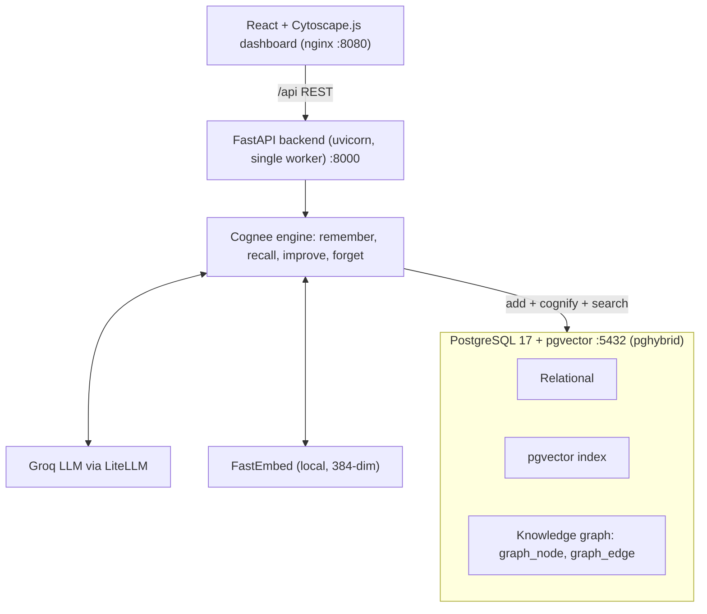

# Architecture

KoshurLock Holmes is a self-hosted, open-source AI incident investigator. The entire memory stack runs on one PostgreSQL instance. There are no proprietary services and no OpenAI dependency.

## Components

- Frontend: React, Vite, TypeScript, Tailwind, and a real interactive knowledge graph rendered with Cytoscape.js. Served by nginx, which also reverse-proxies `/api` to the backend so the browser stays same-origin.
- Backend: Python 3.12, FastAPI, uvicorn with a single worker. It wraps Cognee 1.2.2.
- Memory engine: Cognee 1.2.2. The language model is Groq through a LiteLLM custom provider. Embeddings are computed locally with FastEmbed (all-MiniLM-L6-v2, 384 dimensions).
- Storage: self-hosted PostgreSQL 17 with the pgvector extension. Relational data, vector embeddings, and the knowledge graph all live in the one Postgres.

## Data flow

1. A SOC analyst has scattered enterprise logs (VPN, file access, email, badge, CCTV, HR, threat intel, tips), provided as files. For the demo these live in `backend/data`; for a new case they are uploaded.
2. Ingestion (remember): each source is converted to provenance-wrapped text and added, then cognified. Cognee extracts entities and relationships and writes the knowledge graph into Postgres.
3. Investigation (recall): the analyst asks plain-English questions. Cognee runs a graph-completion search that traverses the graph across all sources and returns a cited, multi-hop answer plus the connected entities and a timeline.
4. Correction (improve): the analyst teaches a confirmed finding, which is added and re-cognified so the graph reweights.
5. Retraction (forget): the analyst forgets a planted or discredited source, and any conclusion built on it collapses so the truth re-derives.
6. The frontend reads the graph as typed nodes and edges, the reconstructed timeline, source status, raw log lines for citations, and system health.

## REST API

All paths are served by FastAPI and reached from the browser under the `/api` prefix, which nginx strips.

- `GET /` API index listing the operations and views.
- `GET /health` liveness plus a direct Postgres connectivity check.
- `GET /status` provider summary (LLM, embeddings, storage), graph node and edge counts, and whether any OpenAI key is present.
- `GET /sources` the active case's evidence list with per-source ingest status.
- `GET /evidence/{filename}` the raw provenance-wrapped log lines for a source, used by citations.
- `GET /graph` the knowledge graph as SOC-typed nodes and edges, with optional structural scaffolding.
- `GET /timeline` the deterministic chronological events for the active case, filterable by actor.
- `POST /ask` recall: a cited, multi-hop answer with connected entities and a timeline.
- `POST /teach` improve: add a confirmed analyst correction and re-cognify.
- `POST /forget` forget: surgically remove one source so conclusions built on it collapse.
- `POST /ingest` remember: build the graph from the seeded evidence, short-circuiting when it is already warm.
- `GET /cases` the case registry with the active and materialized case ids.
- `POST /cases` create a new upload case.
- `POST /cases/{id}/files` upload evidence files to a case.
- `GET /cases/{id}/files` per-file ingest status for a case, used for live polling.
- `POST /cases/{id}/ingest` ingest an uploaded case's files through the real remember path.
- `POST /cases/{id}/open` activate a case and materialize it in the graph if needed.
- `DELETE /cases/{id}` delete an uploaded case and its files. The demo case is protected and cannot be deleted.

## Data model

Cognee stores domain entities as graph nodes linked by typed relationships. The graph transform classifies each node into a small SOC ontology for the visualization: Person, Account, Device, IP, File, Location, and Event, with Document for structural scaffolding and Other as a fallback. Nodes are colored and shaped by type, sized by connectivity, and marked when they match an indicator of compromise. Edges carry the relationship name. The timeline is built deterministically from the evidence text rather than the graph, so it is exact and needs no LLM call.

## Two-mode case model and graph-swap

The app supports a warm seeded demo and a real upload path, and it keeps exactly one case materialized in the graph at a time. This graph-swap model avoids blending answers across cases. The registry tracks which case is active (what the UI is viewing) and which is materialized (whose data is in the graph). Loading the demo restores it warm from the snapshot. Starting a new investigation creates a case, and ingesting it prunes the graph and builds the uploaded case in its own dataset. Deleting the materialized case prunes it and restores the demo, so the graph is never left empty or polluted.

## Why one Postgres for relational, vector, and graph

Cognee 1.2.2 ships a unified provider mode, `USE_UNIFIED_PROVIDER=pghybrid`, that puts both the vector store (pgvector) and the knowledge graph (a native Postgres graph adapter storing `graph_node` and `graph_edge` tables) onto the same relational Postgres engine. This means:

- One service to run and one database to back up. A single `pg_dump` captures the whole memory stack, which is what makes seed-once plus snapshot-and-restore trivial.
- No cross-service boundary between similarity search and graph traversal.
- A clean story for the self-hosted, open-source goal: the entire memory layer is one open-source Postgres container, plus a free Groq LLM and local embeddings.

The exact environment variables were confirmed against the installed Cognee 1.2.2 source rather than guessed. The relational, vector, and graph layers each read their own `DB_*`, `VECTOR_DB_*`, and `GRAPH_DATABASE_*` variables and fall back to the relational `DB_*` credentials when the specific ones are not fully set; pghybrid forces vector and graph onto the relational engine.

## Configuration that makes it work

- LLM: Groq via LiteLLM, `LLM_PROVIDER=custom` with a `groq/` model, and `LLM_INSTRUCTOR_MODE=json_mode`. Groq's Llama models mangle json_schema mode into a broken tool-call path that aborts cognify; plain json_mode is reliable.
- Embeddings: local FastEmbed, `EMBEDDING_MODEL=sentence-transformers/all-MiniLM-L6-v2` with `EMBEDDING_DIMENSIONS=384`. The dimension must be set, otherwise Cognee defaults to 3072 and silently falls back to OpenAI.
- Access control off, `ENABLE_BACKEND_ACCESS_CONTROL=false`: with it on, Cognee partitions the graph per tenant, which fragments cross-source resolution and can report zero nodes.
- `COGNEE_SKIP_CONNECTION_TEST=true` to keep startup fast and deterministic.
- A startup guard, `assert_no_openai`, hard-fails if any provider, model, endpoint, or key could route to OpenAI.

## Configuration decision: Config A and the documented fallback

- Config A (used): `USE_UNIFIED_PROVIDER=pghybrid`, `DB_PROVIDER=postgres`, `VECTOR_DB_PROVIDER=pgvector`, `GRAPH_DATABASE_PROVIDER=postgres`. Relational, vector, and graph all in one Postgres. Snapshot is a single `pg_dump`.
- Config B (documented fallback): if an environment cannot run the Postgres graph cleanly, set `GRAPH_DATABASE_PROVIDER=kuzu` with a graph file path on a mounted volume. Relational and vector stay on Postgres; only the graph moves to embedded Kuzu, and the snapshot then also archives the Kuzu volume. This choice is made by the smoke test, not assumed.

## Startup ordering and the environment gotcha

The environment and the no-OpenAI guard are configured before any module imports Cognee. In the container, all configuration arrives as environment variables from Docker Compose; no `.env` file is copied into the image, so Cognee's own dotenv load has nothing to override the injected values with. On host runs, a helper clears Cognee's cached config factories so a stray `.env` cannot pin a stale value.

## Concurrency and reliable ingest

uvicorn runs a single worker so the in-process asyncio primitives are authoritative. A mutation lock serializes ingest, teach, forget, and prune, which prevents interleaved graph writes and Groq rate-limit bursts. A small semaphore throttles concurrent searches. Every LLM-backed call has exponential backoff on rate-limit responses.

Multi-file uploads are ingested one file at a time. Each file is added and then cognified before the next begins, so only one writer touches the graph tables at any moment. This avoids the Postgres deadlock that concurrent cognify of several documents produced. On top of serialization, the retry wrapper also catches deadlock and serialization-failure errors and re-runs the file with a short backoff, so an occasional contention does not fail a file. Per-file status moves from queued to processing to in graph, or to failed if it exhausts its retries.

## Warm start and in-app restore

Because the whole memory lives in one Postgres, a single `pg_dump` snapshot captures it. A warm-start short-circuit returns the existing graph with no LLM calls when it is already populated, so the app boots warm and the live demo spends no tokens. The demo can also be restored warm from the committed snapshot inside the running backend, which is used when an upload has replaced it in the graph.

## Deployment and ports

The system runs with `docker compose up --build`, which starts three services:

- Postgres on 5432, exposed on the host for smoke tests and snapshots.
- Backend API on 8000.
- Frontend nginx on 8080, proxying `/api` to the backend.
